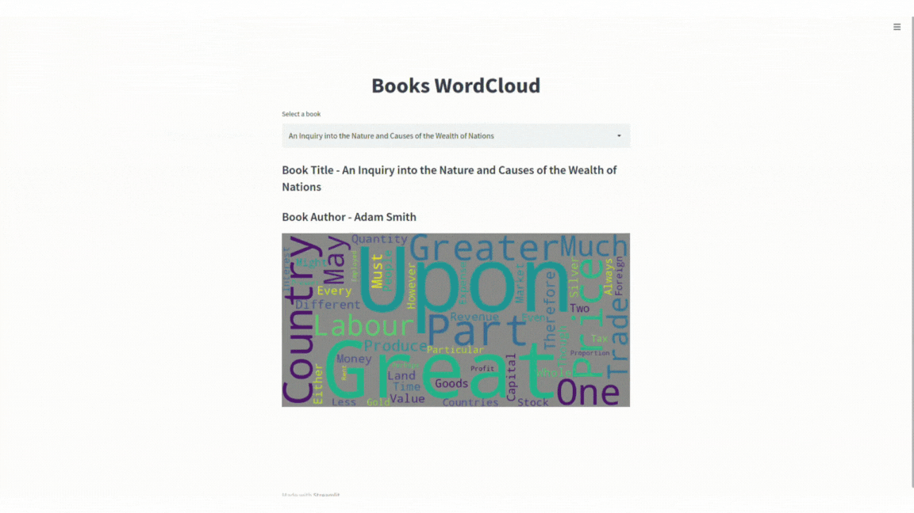

# Boas vindas ao **books_word_cloud!**

Para executar o projeto, observe as orientações descritas a seguir, e se tiver qualquer dúvida, sugestão, contribuição, considere abrir uma issue ou entrar em contato. 🚀

Aqui você vai encontrar os detalhes de como está estruturado e foi desenvolvido o projeto.

# <a id='topicos'>Tópicos</a>
- [Desenvolvimento](#desenvolvimento)
  - [Objetivo](#objetivo)
  - [Estrutura do projeto](#estrutura)
  - [Tecnologias utilizadas](#tecnologias)
- [Orientações](#orientacoes)
  - [Executando o projeto](#execucao)
    - [1. Sem o docker](#sem-docker)
    - [2. Com o docker](#com-docker)
  - [Linter](#linter)
  - [Testes](#testes)
- [Implementações](#implementacoes)
  - [Contextualizando](#contextualizando)
  - [Visão do app](#consumindo)
- [Próximos passos](#next)

# <a id='desenvolvimento'>[Desenvolvimento](#topicos)</a>

<strong><a id='objetivo'>[Objetivo](#topicos)</a></strong>

  O **objetivo** é criar uma nuvem de palavras com o conteúdo de alguns livros populares obtidos pela API [Gutendex](https://gutendex.com/).
  
  Para isso, foi feita a leitura e transformação dos dados com o `Pyspark`, ferramenta que integra técnicas de `machine learning` (tokenização, feature engineering, etc..) com o processamento de big data; e o `streamlit` solução em python geradora de interface gráfica do usuário.

  ---

<strong><a id='estrutura'>[Estrutura do projeto](#topicos)</a></strong>

* **Na pasta [src](src) estão os diretórios:**
  * **[configs](src/configs)** com os arquivos de configuração da execução do código-fonte;
  * **[controllers](src/controllers)** com a [camada](src/controllers/books.py) que orquestra o aplicativo;
  * **[data](src/data)** com [os arquivos de texto](src/data/raw_content) contendo os conteúdos dos livros obtidos pelo [Gutendex](https://gutendex.com/);
  * **[models](src/models)** com a [camada](src/models/books.py) que interage com a fonte de dados do aplicativo;
  * **[services](src/services)** com a [camada](src/services/books.py) que aplica as transformações dos dados e criação da nuvem de palavras;
  * **[utils](src/utils)** com o [arquivo](src/utils/text_search.py) utilitário na execução do código fonte;
  * **[views](src/views)** com a [camada](src/views/books.py) que gera os elementos da interface gráfica do aplicativo.
* **E o arquivo:**
  * **[main.py](src/main.py)** com a classe **Main**, executora do código-fonte da aplicação.
* **Na pasta [tests](tests) estão os arquivos com os testes das respectivas camadas do código-fonte.**
* **E os arquivos:**
  * **[docker-compose.yml](docker-compose.yml)** arquivo que possibilita a execução da aplicação, orquestrando as imagens docker do `spark` e `python`;
  * **[Dockerfile.Python](Dockerfile.Python)** container docker do `python` com as especificações necessárias para a aplicação;
  * **[requirements.txt](requirements.txt)** arquivo com as dependências necessárias e utilizadas para execução do projeto;
  * **[tox.ini](tox.ini)** arquivo com a configuração de uso da [análise estática do código](#linter).

<strong><a id='tecnologias'>[Tecnologias utilizadas](#topicos)</a></strong>

  O projeto foi desenvolvido em Python, desde a interface gráfica até a interação com a fonte dos dados.

  As soluções utilizadas foram:

* **[Pyspark](https://spark.apache.org/docs/latest/api/python/index.html):**
  * Interface para execução do Spark em `python`, com todas as soluções de processamento de dados da ferramenta;
* **[Streamlit](https://streamlit.io/):**
  * Framework do `python` para construção amigável de aplicativos interativos;
* **[Wordcloud](http://amueller.github.io/word_cloud/):**
  * Biblioteca `python` para criação de nuvem de palavras de forma simples.

>No arquivo de dependências, **[requirements.txt](requirements.txt)**, é listada outras dependências acessórias à essas bibliotecas e também utilizadas para **[análise do código](#linter)** e **[testes da aplicação](#testes)**.
    
# <a id='orientacoes'>[Orientações](#topicos)</a>

<strong><a id='execucao'>[Executando o projeto](#topicos)</a></strong>

A aplicação foi pensada para ser testada com o `Docker`, visando torná-la o mais agnóstica possível.

É possível sua execução sem a ferramenta, com sugestões para os dois cenários abaixo:

>**IMPORTANTE**<br/>Independente da escolha, após clonar o projeto, entre com seu terminal na pasta criada:<br/>`cd books_word_cloud`<br/>**Todas orientações abaixo, tem essa pasta como referência.**

### <strong><a id='sem-docker'>[1. Execução sem o docker:](#topicos)</a></strong>

Nesse cenário, é necessário que sua máquina possua instalado: i. o `spark` na versão 3.4.0; ii. o kit de desenvolvimento java (`java jdk`) na versão 8 ou superior; iii. e o `python`. Sobre essas ferramentas:

#### **i. Spark e jdk:**

  **É fundamental o uso das versões recomendadas do spark e java jdk** para integração com sucesso do spark<>pyspark. **Recomenda-se o jdk-11**, versão utilizada na construção da aplicação. 

  **Não foi testado, mas caso use uma versão spark superior à 3.0 localmente, não espera-se incompatibilidade na execução do aplicativo.** Nesse cenário, modifique a versão do pyspark no arquivo requirements.txt antes do próximo passo.

#### **ii. Python:** 
  
  O projeto foi construído com o python na versão 3.10, porém **não se espera indisponibilidades com sua execução à partir da versão 3.4.** 

  **Qualquer incompatibilidade com a versão da sua máquina por favor informe.**

  Ainda, é recomendada a instalação prévia do gerenciador de pacotes `pip` para os passos a seguir:

  >**(Recomendado)** **Utilizar um ambiente virtual** com os seguintes comandos (nome `words_venv` já considerado na ferramenta de [lint](#lint)):
  ```shell
  # cria o ambiente com o nome words_venv:
  python3 -m venv words_venv 
  # ativa o ambiente em terminais Linux e Mac:
  source words_venv/bin/activate
  # ativa o ambiente em terminal Windows (cmd):
  words_venv\bin\activate
  ```
  >1.**Instalar dependências do projeto:**
  ```ps1
  pip install -r requirements.txt
  ```
  >2.**Setar PYTHONPATH:**
  ```shell
  export PYTHONPATH=./
  ```
  >3.**Executar projeto (na pasta criada com o clone):**
  ```bash
  streamlit run src/main.py
  ```
  >4.**Executar projeto instanciando a classe Main (na pasta criada com o clone):**
  ```python
  from src.main import Main

  Main().run()
  ```
  >5.**Executando testes (na pasta criada com o clone):**
  ```ps1
  pytest -v
  pytest --cov=tests/
  ```

### <strong><a id='com-docker'>[2. Execução com o docker:](#topicos)</a></strong>

>**IMPORTANTE**<br/>Nesse cenário recomenda-se utilizar as versões a seguir das ferramentas docker:<br/>`docker:25.0.3`  `docker-compose:1.29.2` <br/>**Verifique suas versões com os comandos:** <br/>`docker version` e `docker-compose -v`

### Usando docker-compose para orquestrar imagens:
Com o docker-compose não é necessário ter o `python`, `java` ou `spark` instalados localmente. Nessa opção, a execução da aplicação será disponível na porta `8501` do servidor local.

Passos para sua inicialização:
```bash
# na raiz do projeto, inicie os containers:
docker-compose up -d
# confirme que estão de pé:
docker-compose ps
# caso tenha erro, ver logs do problema do container:
docker-compose logs book-app # exemplo com container python
# vendo logs de todos os containers:
docker-compose logs
# com a correção do erro, derrube os containers:
docker-compose down
# derrubando os containers forçando a limpeza dos seus volumes:
docker-compose down -v
# reiniciando containers forçando recriação de um deles:
docker-compose up -d --force-recreate book-app
# reiniciando containers forçando o rebuild das imagens:
docker-compose up --build 
```

Com o funcionamento dos containers, é possível executar os arquivos do projeto dessa forma:
```bash
# executando arquivo do container:
docker exec <container_name_or_id> python /caminho/para/seu/arquivo.py
# exemplo de execução dos testes do código:
docker exec book-app pytest -v
# executando arquivos dentro do container:
docker exec -it <container_name> bash
# ex para o cluster do app:
docker exec -it book-app
```
>**IMPORTANTE**<br/>Nos logs de inicialização do container é mostrada onde está localizada o executável java (JAVA_HOME) do container spark. Caso esse valor seja diferente do atual no docker-compose, modifique-o para execução com êxito do projeto.
```dockerfile
environment:
  ...

  - JAVA_HOME=/usr/lib/jvm/java-11-openjdk-amd64 # valor atual.
```

<strong><a id='linter'>[Linter](#topicos)</a></strong>

Foi utilizado o [**flake8**](https://flake8.pycqa.org/en/latest/) para fazer a análise estática do código visando garantir as boas práticas e legibilidade do código.

>Considere instalar as configurações do flake8 no seu editor de texto para contribuições no projeto.

Para executar o `flake8`, no seu terminal Mac ou Linux:
```bash
# na raiz do projeto:
flake8
# analisando um diretório em específico:
flake8 src/
# analisando um arquivo em específico:
flake8 src/main.py
```

<strong><a id='testes'>[Testes](#topicos)</a></strong>

Foi utilizado o **[pytest](https://docs.pytest.org/en/8.0.x/)** e **[unittest](https://docs.python.org/3/library/unittest.html)** para construção dos testes (de integração, unitários e de carga atualmente) da aplicação.

Mais detalhes na documentação dessas bibliotecas.

### Mande seu feedback sobre o projeto!

Se estiver a vontade, clone o repositório e, seja com ou sem o Docker, execute, veja o deploy e me ajude a melhorar este projeto! Seu feedback será super bem vindo!

# <a id='implementacoes'>[Implementações](#topicos)</a>

<strong><a id='contextualizando'>[Contextualizando](#topicos)</a></strong>

  A nuvem de palavras é uma das ferramentas mais populares na análise de sentimento de textos, em especial da técnica de contagem de palavras.

  Para mostrar o potencial da solução, desenvolveu-se essa aplicação que constrói uma nuvem de palavras com `python` e `pyspark`, com as 50 principais palavras de livros famosos disponíveis na API Gutendex.
  
<strong><a id='consumindo'>[Visão do app](#topicos)</a></strong>

  Para execução do projeto (como descrito [nessa seção](#sem-docker)), execute o comando abaixo na raiz do projeto clonado:

  ```bash
  streamlit run src/main.py  
  ```
  
  No seu servidor local, na porta `8501`, a aplicação deve ficar disponível, como abaixo:

  

# <a id='next'>[Próximos passos](#topicos)</a>

  As features mapeadas são:

  * **Fazer o deploy da aplicação**;

  * **Ampliar cenários de testes** garantindo o design da aplicação;

  * **Construir uma esteira de CI/CD** para garantir a governança das implementações do projeto;

  * **Orquestrar o ambiente com Kubernetes**, adicionando uma opção de disponibilidade da execução do projeto;

  * **Gerenciar os containers com helm**, adicionando uma opção dinâmica de disponibilidade da execução do projeto.

---
